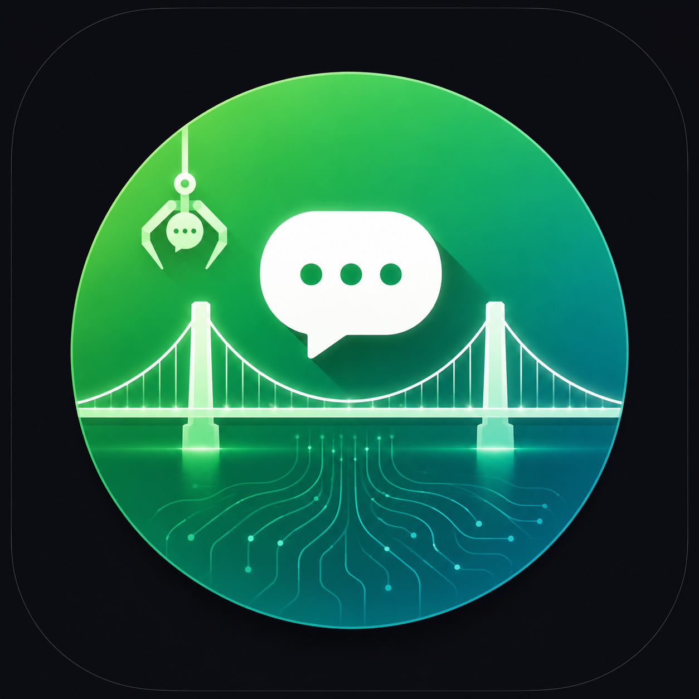

<p align="center">
  
</p>
<!-- 
<h1 align="center">
  <br>
  WeClawBridge
</h1> -->

<p align="center">
  <a href="https://github.com/Gentle-Lijie/WeClawBridge/actions/workflows/ci.yml"></a>
  <a href="https://www.npmjs.com/package/weclaw-bridge"></a>
  <a href="./LICENSE"></a>
</p>

独立、跨平台的微信 **ClawBot**（iLink）协议桥接 —— **无需安装 openclaw 本体**，即可绑定微信 ClawBot 并把任意指令/消息转发到微信。

WeClawBridge 重新实现了 `@tencent-weixin/openclaw-weixin` 插件所用的 iLink HTTP 协议（`ilinkai.weixin.qq.com`）。openclaw 只是一个"宿主框架"，插件本身才是协议实现，因此本桥接可以完全脱离它独立运行。

## 特性

- ✅ **无需 openclaw**：纯协议复刻，零宿主依赖
- ✅ **跨平台 / 跨运行时**：仅用标准 API（`fetch` / `node:http` / `node:crypto`），Node ≥ 18、Bun、Deno 均可
- ✅ **二维码绑定**：终端渲染二维码，手机微信扫码即绑
- ✅ **Webhook 服务**：`POST /send` 把指令转发给微信用户
- ✅ **入站监听**：`getUpdates` 长轮询保活，自动捕获 `context_token`
- ✅ **双向交互（微信 ↔ claude）**：claude 停下时通过 hooks 等待微信回复，回复到达后自动注入继续（asyncRewake）；支持多会话路由与 `/switch` 切换
- ✅ **Claude Code Hooks**：`weclaw hooks install` 一键注册 Stop / Notification / 高危工具事件，自动推送到微信
- ✅ **本地 relay / 一键远程部署**：claude 在本地、桥接在服务器时，`weclaw relay` 做双向中继；`weclaw deploy --ssh` 一键把桥接部署到你自己的服务器（装运行时、迁凭证、nginx 反代、systemd）
- ✅ **推送规则配置面板**：浏览器打开 `weclaw config`，可视化配置事件开关 / 高危工具 / 关键词过滤 / 免打扰时段
- ✅ **入站指令**：在微信里给 bot 发 `/help` `/status` `/accounts` `/ping` `/switch` `/clear` `/version`，直接收到回复
- ✅ **自愈与安全**：`context_token` 失效自动入队重发、出站密钥脱敏、IP 白名单、速率限制、消息归档检索
- ✅ **开机自启**：`weclaw service install` 自动生成 systemd / launchd / 计划任务
- ✅ **Claude Code Skill**：自带一个自愈型 skill `/weclaw-bridge`
- ✅ **多账号**：支持绑定多个微信账号

## ⚠️ 合规与风险提示（务必阅读）

本项目是对微信 ClawBot（iLink）公开协议的**独立重新实现**，仅供学习与个人实验。使用前请对照腾讯《微信 ClawBot 功能使用条款》自行评估：

- **未破解任何技术保护**：本桥接使用与官方插件相同的 iLink 协议和二维码登录流程，未进行 hook、抓包破解或绕过反作弊机制。
- **但属于未授权客户端类型**：官方授权路径为 `openclaw 宿主 + 官方插件`。依据条款 **4.7**，腾讯保留决定可使用的客户端类型、并对未授权客户端采取**风险提示、拦截、封禁**的权利。
- **账号与服务风险**：不走官方路径，可能被认定为条款 **4.6**（绕开技术保护措施）情形，触发 **6.1 / 6.4** 违约处理——从警告、暂停服务，到**终止微信账号服务**。
- **用途偏离**：ClawBot 设计用途是连接"用户自己部署的第三方 AI 服务"（条款 **3.1 / 4.3**）。将其用作通用推送/通知通道偏离预期用途。
- **数据合规**：条款 **5.1** 要求涉及他人个人信息的内容须在授权范围内使用；转发内容请确保合法合规、已获授权。

**正式或商用场景请使用官方 openclaw 路径。** 本项目作者不对因使用本工具导致的任何账号限制、服务中断或法律后果承担责任。使用即代表你已阅读、理解并接受上述全部风险。

## 安装

### 方式一：npx（无需安装，直接用）

```bash
npx -y weclaw-bridge login     # 绑定
npx -y weclaw-bridge start     # 运行
```

### 方式二：全局安装

```bash
npm install -g weclaw-bridge
weclaw login
weclaw start
```

> 安装时会自动检测你的系统（Linux/macOS/Windows）并打印对应的开机自启指引。CI 环境下自动静默（设 `WECLAW_SKIP_POSTINSTALL=1` 可彻底关闭）。

### 方式三：从源码

```bash
git clone https://github.com/Gentle-Lijie/WeClawBridge.git
cd WeClawBridge
npm install && npm run build
node bin/weclaw.mjs login
```

## 5 分钟快速开始

```bash
# 1) 绑定（终端出现二维码，用手机微信扫描并输入配对数字）
weclaw login

# 2) 启动桥接服务（监听 + webhook，默认 http://127.0.0.1:4789）
weclaw start

# 3) 在手机微信里给 ClawBot 发一条 "hello"（首次必需，用于建立会话）

# 4) 转发一条指令到微信
curl -X POST http://127.0.0.1:4789/send \
  -H "Content-Type: application/json" \
  -d '{"text":"你好，这是来自桥接的测试"}'
```

手机微信收到消息即代表链路打通。

## 工作原理

```
                你的指令                      微信 App
                   │                            │
                   ▼                            │
        ┌─────────────────────┐                 │
        │  WeClawBridge       │  iLink HTTP     │
        │  (本工具)            │ ◄──────────────►│  ilinkai.weixin.qq.com
        │  - getUpdates 长轮询 │                 │
        │  - sendMessage      │                 │
        │  - webhook /send    │                 │
        └─────────────────────┘                 │
                   ▲                            ▼
              webhook 调用                  用户在微信里收到消息
       (外部 agent / Claude / 脚本)
```

- **绑定**：`get_bot_qrcode` → 扫码 → 长轮询 `get_qrcode_status`（含配对码校验、过期刷新、IDC 重定向）→ `confirmed` 后保存 `bot_token` / `accountId` / `userId`。
- **转发**：webhook 收到 `{text, to?}` → 用缓存好的 `context_token` 调 `sendmessage` → 微信用户收到消息。

## CLI 命令

| 命令 | 说明 |
|------|------|
| `weclaw login` | 终端扫码绑定微信 ClawBot |
| `weclaw start` | 运行入站监听 + webhook 服务 |
| `weclaw relay --remote URL` | 本地中继：claude 在本地、桥接在服务器时双向转发 |
| `weclaw deploy --ssh user@host` | 一键把桥接部署到你的服务器（迁凭证 / nginx 反代 / systemd） |
| `weclaw hooks install` | 注册 Claude Code hooks（Stop/Notification/高危 → 微信，+ asyncRewake 回复注入） |
| `weclaw hook` | hooks 分发器入口（由 Claude Code 自动调用） |
| `weclaw config` | 浏览器打开推送规则配置面板 |
| `weclaw send --text "..."` | 单次把文字转发给微信用户 |
| `weclaw status` | 列出已绑定账号 |
| `weclaw accounts` | 以 JSON 列出 accountId |
| `weclaw sessions` | 列出已注册的 claude 会话（多会话路由） |
| `weclaw search --query <词>` | 检索消息归档（入站/出站） |
| `weclaw logout [--account ID]` | 解绑账号 |
| `weclaw service install` | 安装开机自启服务（systemd / launchd / 计划任务，支持 `--relay`） |
| `weclaw service uninstall` | 卸载自启服务 |
| `weclaw service status` | 查看服务运行状态 |
| `weclaw service restart` | 重启服务 |

常用参数：`--port`、`--host`、`--api-token`、`--to`、`--account`、`--base-url`。

## 开机自启（systemd / launchd / Windows）

`weclaw service install` 会按当前系统生成并启用对应服务：

| 系统 | 服务类型 | 路径 |
|------|---------|------|
| Linux | systemd user unit | `~/.config/systemd/user/weclaw-bridge.service` |
| macOS | launchd LaunchAgent | `~/Library/LaunchAgents/com.weclaw.bridge.plist` |
| Windows | 计划任务（登录时运行） | 任务名 `weclaw-bridge` |

```bash
weclaw service install --port 4789 --host 127.0.0.1   # 安装并启动
weclaw service status                                  # 查看状态
weclaw service restart                                 # 重启
weclaw service uninstall                               # 卸载
```

- Linux：会尝试 `loginctl enable-linger`（让服务在未登录时也运行），需要时可加 sudo。
- macOS：日志写入 `~/.weclaw-bridge/weclaw.log` 与 `weclaw.err.log`。
- 服务用 `node <包路径>/dist/cli.js start` 启动，环境变量（端口/host/token）写入服务单元。

## Webhook 接口

| Method | Path | Body | 说明 |
|--------|------|------|------|
| GET | `/` | — | 推送规则配置面板（HTML） |
| GET | `/health` | — | 存活检查 + monitor/SSE/队列概览（公开） |
| GET | `/status` | — | 账号 + 监听 + token 新鲜度 + 队列（userId 脱敏） |
| GET | `/accounts` | — | 列出 accountId |
| GET | `/events` | — | SSE 入站消息流（可按 `?accountId`/`?userId`/`?session` 过滤） |
| GET | `/config` | — | 读取推送规则（hooks.json） |
| POST | `/config` | `{...}` | 保存推送规则 |
| POST | `/routes` | `{"session","userId"?,"account"?}` | 注册 claude 会话（SessionStart） |
| POST | `/send` | `{"text","to"?,"account"?,"session"?}` | 转发文字到微信（自动脱敏/分块；失败入队） |
| POST | `/login/start` | — | 拉取二维码，返回 `{qrcodeUrl, sessionKey}`（可关闭） |
| POST | `/login/wait` | `{"sessionKey","verifyCode"?}` | 轮询登录状态 |

鉴权：设置 `WECLAW_API_TOKEN` 后，除 `/health`、`/`、`/events` 外需 `Authorization: Bearer <token>`（仅 header，不接受 query）。

错误码：`400` 参数错误 · `401` 未授权 · `404` 未绑定账号 · `409` 账号未配置 · `502` 发送失败（`ret=-2 prepare failed` 多为缺 `context_token`；`errcode=-14` 为 token 失效需重新登录）。

## 环境变量

| 变量 | 默认 | 说明 |
|------|------|------|
| `WECLAW_STATE_DIR` | `~/.weclaw-bridge` | 状态目录（凭证 / sync buf / context token / pending / archive） |
| `WECLAW_PORT` | `4789` | webhook 端口 |
| `WECLAW_HOST` | `127.0.0.1` | 监听地址 |
| `WECLAW_API_TOKEN` | — | webhook 写接口的 Bearer token |
| `WECLAW_INBOUND_WEBHOOK` | — | 把收到的微信消息镜像到该 URL（实现"微信→外部 agent"反向通知） |
| `WECLAW_DISABLE_LOGIN` | — | `=1` 关闭 `/login/*`（公网部署建议） |
| `WECLAW_ALLOW_IPS` | — | 非健康检查端点的 IP 白名单（逗号分隔） |
| `WECLAW_TRUST_PROXY` | — | `=1` 信任 `X-Forwarded-For`（反代后必填） |
| `WECLAW_RATE_LIMIT` | — | 每个 IP 每分钟 `/send` 上限 |
| `WECLAW_NO_REDACT` | — | `=1` 关闭出站密钥脱敏 |
| `WECLAW_INBOX_ALLOW` | — | 入站 `/` 指令的白名单 userId（逗号分隔，空=不限） |
| `WECLAW_INBOX_DISABLE` | `=1` | 服务器纯转发模式（配合本地 relay）。**本地 relay 未连接时**，服务器仍会兜底应答 `/ping` `/version` `/status`，用于区分「服务器挂了」和「只是本地 relay 没开」 |
| `WECLAW_REMOTE_URL` | — | relay 模式的服务器桥接地址 |
| `WECLAW_SESSION_TAG` | — | `=false` 关闭多会话微信打标 `[xxxx]` |
| `OPENCLAW_STATE_DIR` | — | 复用已有 openclaw 绑定（可选） |
| `WECLAW_SKIP_POSTINSTALL` | — | 安装时跳过平台提示横幅 |

## 完整测试指南

### 冒烟测试（无需手机）

```bash
npm install && npm run build

# CLI 基础
weclaw help          # 打印用法
weclaw status        # 提示"尚未绑定任何账号"
weclaw accounts      # {"accounts":[]}

# 真实拉取二维码（验证与 ilinkai.weixin.qq.com 连通，不扫码，Ctrl+C 退出）
weclaw login

# 服务起停 + 错误码
WECLAW_PORT=4791 WECLAW_API_TOKEN=test123 weclaw start &
sleep 1.5
curl -s http://127.0.0.1:4791/health                                       # → {"ok":true}
curl -s -o /dev/null -w "%{http}\n" http://127.0.0.1:4791/status           # → 401
curl -s -H "Authorization: Bearer test123" http://127.0.0.1:4791/status    # → {"accounts":[]}
curl -s -w "%{http}\n" -X POST -H "Authorization: Bearer test123" \
     -H "Content-Type: application/json" -d '{}' http://127.0.0.1:4791/send # → 400
kill %1
```

### 端到端测试（需要手机微信）

```bash
# 1. 绑定
weclaw login            # 扫码 → 看到 "✅ 已绑定"

# 2. 启动服务（常驻）
weclaw start

# 3. 手机微信 ClawBot 对话里发一条 "hello"
#    （服务端日志应出现 inbound from=...@im.wechat: hello）

# 4. 转发
curl -X POST http://127.0.0.1:4789/send \
  -H "Content-Type: application/json" -d '{"text":"桥接测试：你好"}'
# → {"ok":true,...}，手机收到消息即成功
```

### 自动化测试矩阵（CI 已覆盖）

GitHub Actions 在 `ubuntu / macos / windows` × `Node 18/20/22` 上运行 `typecheck + build + CLI 冒烟`。打 `v*` tag 自动发布到 npm。

## 作为库使用

```ts
import { IlinkClient, loginWithQr, sendText } from "weclaw-bridge";

const result = await loginWithQr({ verbose: true });           // 绑定
const client = new IlinkClient({ baseUrl: result.baseUrl, token: result.botToken });
await sendText(client, { to: result.userId, text: "hello" });  // 转发
```

## Claude Code Skill

自带的 `/weclaw-bridge` skill 是**自愈型**的：服务没起会自动后台拉起，没绑账号会引导 `login`，发送遇到 `prepare failed` 会提示用户先在微信发条消息建立会话。

- 全局可用：`~/.claude/skills/weclaw-bridge/`
- 仓库内：`skill/weclaw-bridge/SKILL.md`（提交到 git）

安装到本地全局：
```bash
mkdir -p ~/.claude/skills && cp -r skill/weclaw-bridge ~/.claude/skills/
```

之后在任意 Claude Code 会话里说"用 weclaw-bridge 把 xxx 发到微信"即可。

## 跨运行时

编译产物 `dist/` 仅依赖标准 Web API + Node 内建模块：

```bash
node bin/weclaw.mjs start
bun  bin/weclaw.mjs start
deno run --allow-net --allow-read --allow-write --allow-env bin/weclaw.mjs start
```

## 项目结构

```
src/
├── ilink/        # 协议层：types + HTTP client
├── store/        # 账号 / sync buf / context token / sessions / pending / archive
├── auth/         # 二维码登录流程
├── bridge/       # 监听循环 + webhook server + 发送 + relay + inbox + outbox
├── hooks/        # Claude Code hooks 分发器 + 推送规则配置 + 安装器
├── service/      # systemd/launchd/计划任务 自启管理 + 远程部署
├── util/         # id / logger / redact / text
├── index.ts      # 公共 API
└── cli.ts        # CLI 入口
bin/
├── weclaw.mjs        # CLI 启动器
└── postinstall.mjs   # 平台识别 + 自启指引
assets/config.html    # 推送规则配置面板
skill/weclaw-bridge/SKILL.md   # Claude Code skill
.github/workflows/ci.yml       # CI（打 v* tag 自动发布到 npm）
```

## 重要说明

- **首次回复需 context_token**：微信要求回复必须携带入站消息的 `context_token`。绑定后，目标用户需先在微信里给 ClawBot 发过至少一条消息（桥接会自动捕获 token）；或显式传 `--to <xxx@im.wechat>`。
- 本项目是对公开协议的独立实现，仅用于学习与个人桥接实验。
- 凭证文件权限设为 `0600`，请勿提交到版本库（`.weclaw/` 已在 `.gitignore`）。

## 双向交互（微信 ↔ claude）

WeClawBridge 不仅是单向推送——claude 可以**等待微信回复并据此继续**。这是通过 Claude Code hooks 的 `asyncRewake` 机制实现的（本地与服务器场景共用同一套 pending 逻辑）。

```bash
# 1) 在你的项目里注册 hooks（事件推送到微信 + 回合制回复注入）
weclaw hooks install --local true --target http://127.0.0.1:4789 --notify-stop true --async-rewake true

# 2) 起一个交互式 claude，让它做完一件事后停下等你
claude
# > 查一下目录文件数，然后停下来。我会通过微信告诉你下一步，收到后再继续。

# 3) claude 停下 → 微信收到「✅ 任务完成」摘要，asyncRewake 后台等待回复（最多 8 分钟）

# 4) 在手机微信给 bot 回复一句（不要用 / 开头）
# → 微信收到「✅ 已收到你的回复并送达 claude 会话」回执
# → claude 在终端被唤醒，把你的回复当作指令继续执行
```

**多会话**：每个 claude 会话首次 `/send` 时自动登记（绑定到你的微信），并记录其宿主进程（pid + 启动指纹）。`/switch` 在微信里列出/切换当前活跃会话，**列出时会探测每个会话的进程存活**——已退出的自动清理（含被 kill / 崩溃而没触发 SessionEnd 的孤儿），升级前的旧记录标 ❔ 可用 `/clear all` 一次清空；非命令回复会路由到当前活跃会话的 pending 队列（活跃会话进程已死时自动回落到普通匹配）。`/version` 显示电脑端与服务器端版本号。

> 注：`asyncRewake` 在 `claude -p`（headless）模式下会在结束时被回收；**双向回复注入需用交互式 `claude` 会话**。

## 推送规则配置面板

```bash
weclaw config   # 浏览器打开 http://127.0.0.1:4789/
```

可视化配置（保存到 `~/.weclaw-bridge/hooks.json`，立即生效）：
- 事件开关：任务完成摘要 / 需要输入确认 / 回合制回复注入
- 高危工具告警（权限规则语法，如 `Bash(git push *)`）
- 关键词过滤（仅当包含 / 包含时不推）
- 免打扰时段（该时段抑制推送，回复注入仍生效）

规则由 `weclaw hook` 分发器在每次事件触发时读取，所以改完即刻生效，无需重装 hooks。

## 远程部署（claude 在本地、桥接在服务器）

```bash
# 一键部署桥接到你的服务器（SSH 进去装、迁凭证、nginx 反代、systemd）
weclaw deploy --ssh user@host --domain bridge.example.com

# 部署完成后，本地用 relay 中继（skill/hooks 仍指向 127.0.0.1，零改动）
weclaw relay --remote https://bridge.example.com --api-token <部署时生成的 token>
```

`deploy` 会自动：探测系统 → 装 Node + weclaw-bridge → 原子迁移绑定凭证 → 写 nginx vhost 反代（HTTP；**TLS 由你在服务器侧配置**：面板一键或 certbot）→ 生成强 token → systemd 服务（loopback + token + 关闭 login + IP 白名单）→ 回填本地 `remote.env` → 冒烟测试；失败时打印每步的回滚命令。

> ⚠️ 同一 `bot_token` 不能两处同时长轮询。部署是「迁移」：服务器接管 monitor，本地改用 `relay`。`relay` 同时做出站代理（转发 `/send`，断网缓存）与入站订阅（`/events` SSE → 本地 pending），让本地 claude 的双向 hooks 照常工作。

## 许可证

MIT
